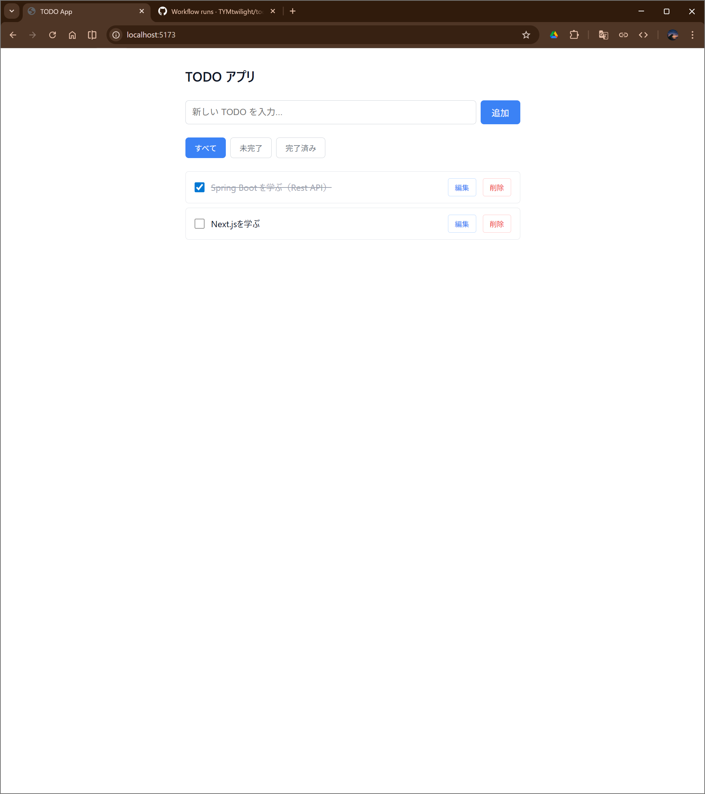
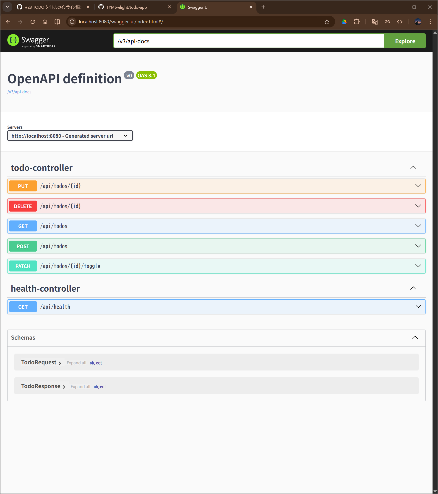

\# TODO App

Spring Boot + React で構築する TODO アプリケーション。




## 技術スタック

### バックエンド
- Java 17
- Spring Boot 3.x
- Spring Data JPA
- H2 Database（インメモリ）
- Bean Validation
- SpringDoc OpenAPI（Swagger UI）

### フロントエンド
- React 18
- Vite
- TypeScript
- CSS Modules

### テスト
- バックエンド: JUnit 5 / Mockito / MockMvc
- フロントエンド: Vitest / React Testing Library / MSW

### CI
- GitHub Actions

## セットアップ

### 必要な環境
- Java 17+
- Node.js 20+
- npm

### バックエンド
```bash
cd backend
./gradlew bootRun
```

http://localhost:8080 で起動。

- Swagger UI: http://localhost:8080/swagger-ui/index.html
- H2 Console: http://localhost:8080/h2-console（JDBC URL: `jdbc:h2:mem:tododb`）

### フロントエンド
```bash
cd frontend
npm install
npm run dev
```

http://localhost:5173 で起動。

## テストの実行

### バックエンド
```bash
cd backend
./gradlew test
```

テストレポート: `backend/build/reports/tests/test/index.html`

### フロントエンド
```bash
cd frontend
npx vitest run
```

## API エンドポイント

| メソッド | パス | 説明 |
|---------|------|------|
| GET | `/api/todos?status=ALL\|ACTIVE\|COMPLETED` | TODO 一覧取得 |
| POST | `/api/todos` | TODO 作成 |
| PUT | `/api/todos/{id}` | TODO 更新 |
| PATCH | `/api/todos/{id}/toggle` | 完了状態切り替え |
| DELETE | `/api/todos/{id}` | TODO 削除 |
| GET | `/api/health` | ヘルスチェック |

## プロジェクト構成